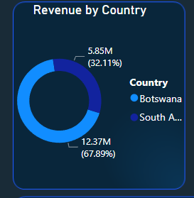
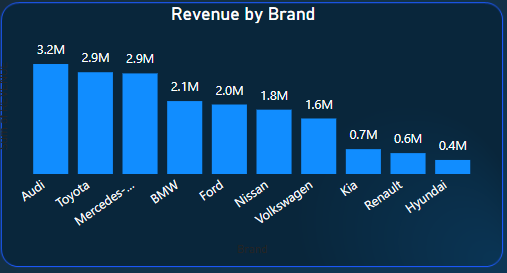
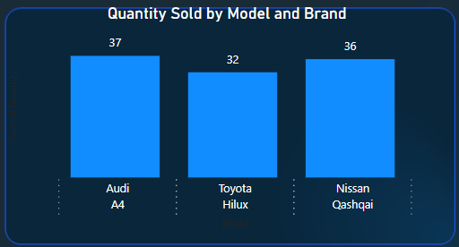
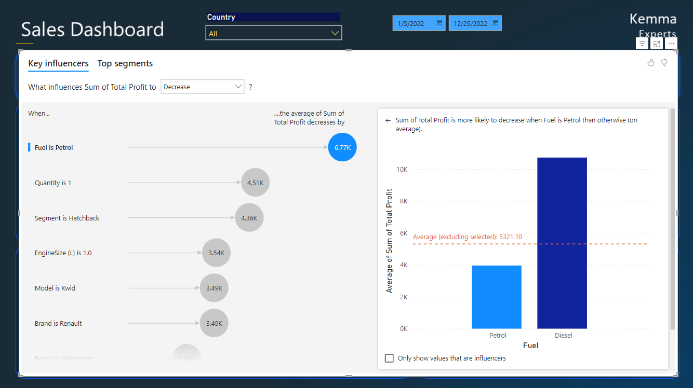
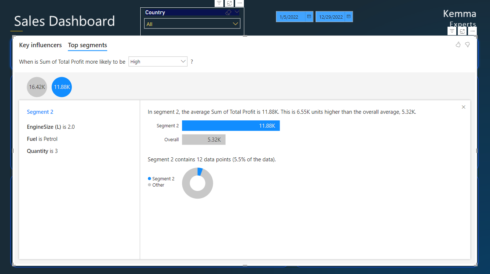
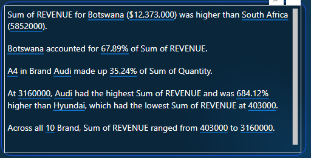
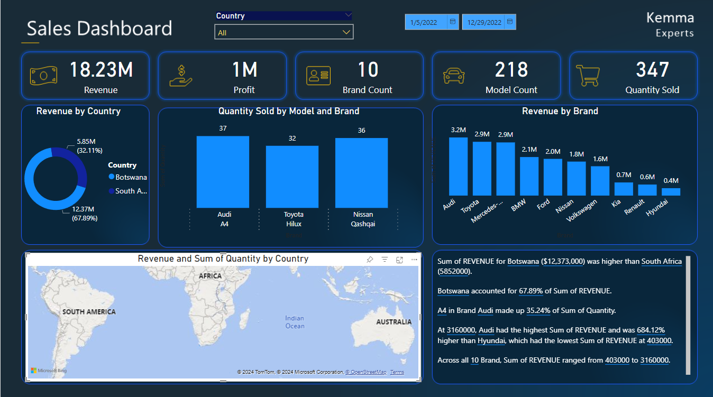

# Power-BI-Sales-Dashboard

## INTRODUCTION
This project aims to develop a Data Analysis tool for analyzing the overall sales  using Power BI.

The Report consists of three pages:

A report page

AI Narrative Page

## PROBLEM STATEMENT
- To  present revenue by countries
  
- To identify the top 3 cars sold

- Compare Revenue and Pofit between the Brands
  
- Show Revenue and Sales by City and Dealer

## SKILLS DEMONSTRATED

**AI Narrative integration** 

## DATA SOURCING
The Data was extracted from the Kaggle data set
The primary data source used for this analysis is the sales data containing detailed data about sales by the company.

## DATA TRANSFORMATION
Data cleaning and transformation were carried out using Power Query. After scrutinizing all the columns, they were found valid and devoid of empty cells and errors.

## MODELLING
The data was modelled to find the relationship between various tables

The invoice table is marked as the fact table with the Carrier and ClientBase tables being dimension tables

## ANALYSIS AND VISUALIZATION
### KPI 
The KPIs focused on in this analysis are revenue, profit, brand count, model count and quantity sold.
The total revenue for the period under review is USD 18.23 Million.

### Revenue by Country
The diagram below shows the revenue by country. Botswana experienced higher revenue as compared to South Africa with 67.89%.

### Revenue by Brand

### Quantity Sold by Brand

## CONCLUSION AND RECOMMENDATION

Click the link below to have live interactions with the report on the Power BI Service

<https://app.powerbi.com/links/V4IW1RJBp2?ctid=42f54956-ca72-48cd-82ca-3f93df64a015&pbi_source=linkShare>

